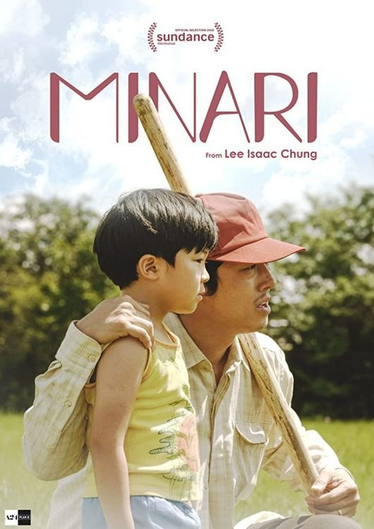

# 미나리의 윤여정

데뷔 55년차인 원로배우로, 2021년 현재까지도 주조연 가리지 않고 여러 역할을 소화하며 현역으로 왕성하게 활동 중이다. 연기력도 뛰어나서, 선역과 악역을 자유롭게 넘나든다. 2020년 6월 19일에 73세 생일을 맞이했다.

주로 상당히 까다롭고 엄격하고 보수적인 시어머니 포지션의 배역이나 잔소리 잘하고 무척이나 고집 센 아주머니, 할머니 정도의 이미지가 널리 알려졌지만 영화에서는 카리스마 있는 역할부터 가루지기에서 같은 미묘한 색기가 있는 역할까지 다양한 연기를 보여준다. 현재 73세이지만, 극과 극을 넘나들면서 연기한다. 손녀밖에 모르는 손녀바보 해녀할망과 돈을 받고 노인들에게 성을 파는 박카스 할머니까지 대단히 넓은 스펙트럼을 가진 배우이다.

전면에 나서지 않는 배역도 어느새 극의 키로 만드는 유니크한 색으로 무장된 독보적 영역을 소유한 연기자로서 감각적이고 유려한 구성이지만 편안하고 힘을 한껏 빼 이완된 상태에서 흐름을 만들어 나가 기술적으로도 상당히 뛰어난 완급조절을 보여주는 명배우.

이는 신인시절 과한 동작과 분장 등으로 극대화되고 과장된 연기를 선보이는 기성 연기자들의 연기에 강한 반감이 들어 초기부터 자신만의 리얼리즘적인 방향성을 구상하고 연구한 결과물이다.
